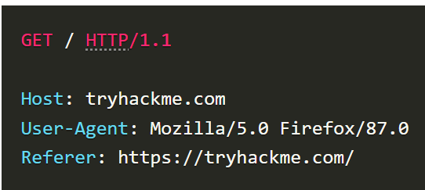

# Room 1 - DNS in detail

- Translates website names to IP addresses. 

## Domain heirarchy
- Take admin.tryhackme.com as an example. Always, the right most part of a domain name is the top-level domain (TLD). 

    Second level domain is to the left of the TLD. 

    Subdomains are to the left of second level domains and separated by periods. **Even "www" is a subdomain!** 

    In our example, 

    - TLD: .com

    - Second level domain: tryhackme

    - Subdomain: admin

    

## Record types

- A record: These records resolve to IPv4 addresses, for example 104.26.10.229.

- AAAA record: These records resolve to IPv6 addresses, for example 2606:4700:20::681a:be5.

- CNAME record: Alias records for domains. 

## What happens when you make a DNS request?

Client <-> Recursive DNS server (usually provided by ISP) -> Root DNS server (.) -> TLD (.com) -> Authoritative server (OR name server) which has accurate DNS records for the requested domain.

# Room 2 - HTTP in detail

## Requests and responses

- URL: 

    A URL is an instruction to the browser on how to access a resource on a web server. 

    

    - Path: The file name or location of the resource you are trying to access.

    - Query String: Extra bits of information that can be sent to the requested path. For example, /blog?id=1 would tell the blog path that you wish to receive the blog article with the id of 1.

    - Fragment: This is a reference to a location on the actual page requested. This is commonly used for pages with long content and can have a certain part of the page directly linked to it, so it is viewable to the user as soon as they access the page.

- Requests

    

    1. Line 1 indicates that GET method is used to get home page (/) and we tell the web server that HTTP protocol version 1.1 is being used. 

## HTTP methods

HTTP methods are a way for the client (browser) to show their intended action when making an HTTP request.

1. GET - get information from web server.
1. POST - submit data to web server and create new records. 
1. PUT - submit data to web server to update information. 
1. DELETE

## HEADERS

### Common request headers

1. Host: Some web servers host multiple websites so by providing the host headers you can tell it which one you require, otherwise you'll just receive the default website for the server.

1. Content-Length: When sending data to a web server such as in a form, the content length tells the web server how much data to expect in the web request. 

1. Cookie: Data sent to the server to help remember your information.

### Common response headers

1. Set-Cookie: Information to store which gets sent back to the web server on each request.

## Cookies

Because HTTP is stateless (doesn't keep track of your previous requests), cookies can be used to remind the web server who you are.

1. Web server first sends cookie value in set-cookie header to browser and browser stores this. 
1. In every request made by the browser to the web server, the browser sends the cookie value inside the cookie header.

# Room 3 - How websites work

## How websites work

There are two major components that make up a website:

1. Front End (Client-Side) - the way your browser renders a website.
1. Back End (Server-Side) - a server that processes your request and returns a response.

