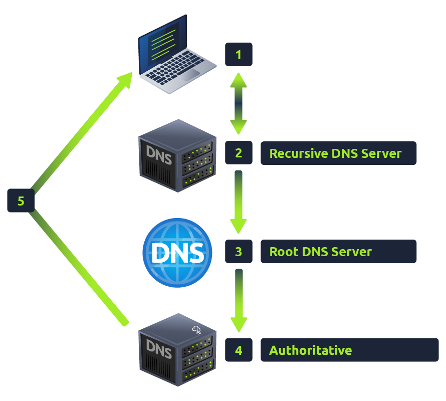
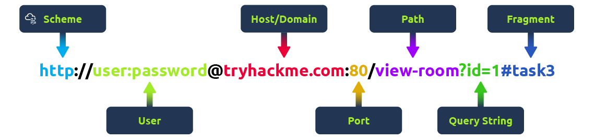

# Room 1 - DNS in detail

- Translates website names to IP addresses. 

## Domain heirarchy
- Take admin.tryhackme.com as an example. Always, the right most part of a domain name is the top-level domain (TLD). 

    Second level domain is to the left of the TLD. 

    Subdomains are to the left of second level domains and separated by periods. **Even "www" is a subdomain!** 

    In our example, 

    - TLD: .com

    - Second level domain: tryhackme

    - Subdomain: admin

    

## Record types

- A record: These records resolve to IPv4 addresses, for example 104.26.10.229.

- AAAA record: These records resolve to IPv6 addresses, for example 2606:4700:20::681a:be5.

- CNAME record: Alias records for domains. 

## What happens when you make a DNS request?

Client <-> Recursive DNS server (usually provided by ISP) -> Root DNS server (.) -> TLD (.com) -> Authoritative server (OR name server) which has accurate DNS records for the requested domain.

# Room 2 - HTTP in detail

## Requests and responses

- URL: 

    A URL is an instruction to the browser on how to access a resource on a web server. 

    

    - Path: The file name or location of the resource you are trying to access.

    - Query String: Extra bits of information that can be sent to the requested path. For example, /blog?id=1 would tell the blog path that you wish to receive the blog article with the id of 1.

    - Fragment: This is a reference to a location on the actual page requested. This is commonly used for pages with long content and can have a certain part of the page directly linked to it, so it is viewable to the user as soon as they access the page.

- Requests

    

    1. Line 1 indicates that GET method is used to get home page (/) and we tell the web server that HTTP protocol version 1.1 is being used. 

## HTTP methods

HTTP methods are a way for the client (browser) to show their intended action when making an HTTP request.

1. GET - get information from web server.
1. POST - submit data to web server and create new records. 
1. PUT - submit data to web server to update information. 
1. DELETE

## HEADERS

### Common request headers

1. Host: Some web servers host multiple websites so by providing the host headers you can tell it which one you require, otherwise you'll just receive the default website for the server.

1. Content-Length: When sending data to a web server such as in a form, the content length tells the web server how much data to expect in the web request. 

1. Cookie: Data sent to the server to help remember your information.

### Common response headers

1. Set-Cookie: Information to store which gets sent back to the web server on each request.

## Cookies

Because HTTP is stateless (doesn't keep track of your previous requests), cookies can be used to remind the web server who you are.

1. Web server first sends cookie value in set-cookie header to browser and browser stores this. 
1. In every request made by the browser to the web server, the browser sends the cookie value inside the cookie header.

# Room 3 - How websites work

## How websites work

There are two major components that make up a website:

1. Front End (Client-Side) - the way your browser renders a website.
1. Back End (Server-Side) - a server that processes your request and returns a response.

## HTML injection

No user input sanitization leads to this outcome. 

The image above shows how a form outputs text to the page. Whatever the user inputs into the "What's your name" field is passed to a JavaScript function and output to the page, which means if the user adds their own HTML or JavaScript in the field, it's used in the sayHi function and is added to the page - this means you can add your own HTML (such as a \<h1> tag) and it will output your input as pure HTML.

The general rule is never to trust user input. To prevent malicious input, the website developer should sanitise everything the user enters before using it in the JavaScript function; in this case, the developer could remove any HTML tags.

# Room 4 - Putting it all together

## High level overview of how a webpage is viewed

1. Client gets IP address of target web server from DNS.

1. Client sends HTTP request to web server.

1. Web server gives HTTP response. 

1. Client browser interprets the received HTTP response and displays webpage. 

## Other components that aid working of web

1. WAF (Web Application Firewall)

    

    Main aim is to protect the web server from DoS, DDoS attacks and in general any harm. 

## How web servers work

### What is a web server

Web server is a software listening for incoming connections and then utilises the HTTP protocol to deliver web content to its clients. The **most common web server software you'll come across is Apache, Nginx, IIS and NodeJS**. A Web server delivers files from what's called its root directory, which is defined in the software settings.

### Virtual hosts

Web servers can host multiple websites with different domain names; to achieve this, they use virtual hosts. 

The web server software checks the hostname being requested from the HTTP Request headers and matches that against its virtual hosts (virtual hosts are just text-based configuration files). If it finds a match, the correct website will be provided. If no match is found, the default website will be provided instead.

Virtual Hosts can have their root directory mapped to different locations on the hard drive. For example, one.com being mapped to /var/www/website_one, and two.com being mapped to /var/www/website_two

There's no limit to the number of different websites you can host on a web server.

### Static Vs Dynamic Content

1. Static content - 

    Never changes. These files are served directly from web server with no changes. 

1. Dynamic content - 

    Content that changes with different requests. Imagine searching a blog site with certain keywords. As you change the keywords being searched for, the displayed content also changes. This is hence dynamic content. 

    These changes are done in the backend.  You can't view the websites' HTML source and see what's happening in the Backend, while the HTML is the result of the processing from the Backend.

    Dynamic content has two types:

    1. Traditional (Server-rendered) Approach:

        Using PHP for example. Consider the blog website searching functionality. In server-rendered approach, every new search sends a brand new request to the web server, the backend processes the request and sends a HTML page in response. 

    1. Modern (Client-rendered or SPA) Approach:

        Using JS frameworks like React, Angular etc. In these cases, when you change keywords the browser sends an AJAX request (such as a fetch or XMLHttpRequest) to the backend server with the new keywords.

        **The server responds with data only (usually in JSON format), not a full HTML page.**

        The frontend JavaScript code then updates the visible content by modifying the DOM, often without a full page reload or receiving a new HTML page from the server.

