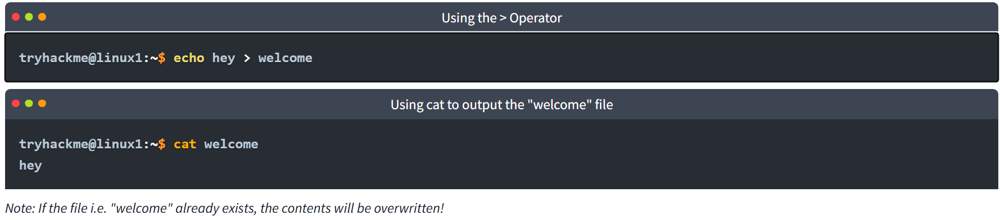
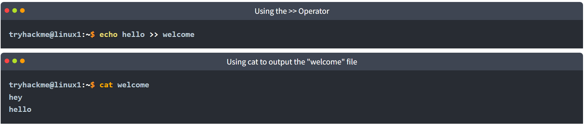
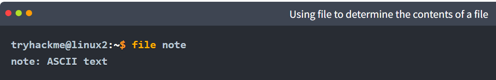
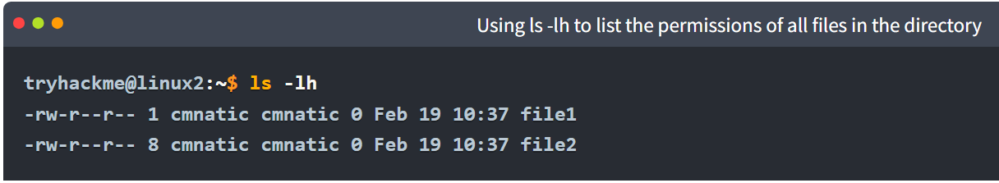
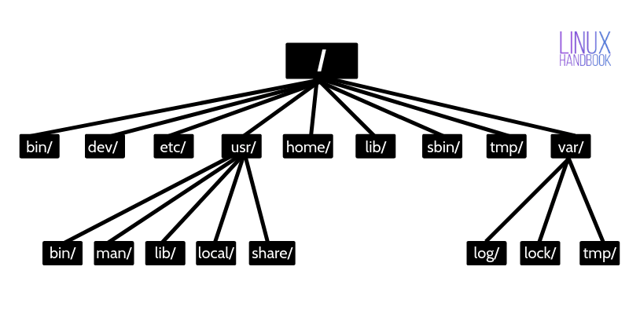
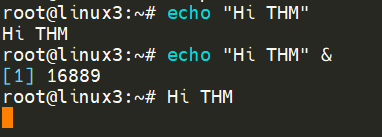
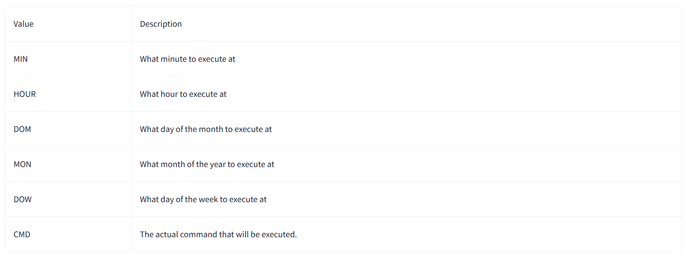

# Room 1 - Linux fundamentals part 1

## Searching for files

1. `find`

    We can **search for files** using the `find` command. 

    1. `find -name passwords.txt`

        If we already know the name of the file we are looking for. This commands looks for the file in the current working directory. 

    1. `find -name *.txt`

        Find all files in current directory that have .txt extension. 

1. `grep`

    The grep command allows us to **search the contents of files** for specific values that we are looking for.

## Intro to shell operators

1. &

    This operator allows us to execute commands in the background.

1. &&

    we can use "&&" to make a list of commands to run for example `command1 && command2`. However, it's worth noting that `command2` will only run if `command1` was successful.

1. \>

    Redirection operator. `echo hey > welcome` puts "hey" inside a file named "welcome". If welcome file already exists, it will be overwritten. 

    

1. \>\>

    Also a redirection operator but appends content rather than overwriting. 

    In the previous example we overwrote a welcome file with content "hey". We can append to this file the word "hello" using the >> operator. 

    

# Room 2 - Linux Fundamentals part 2

## Intro to flags and switches

1. **Switch / flag**

    In `ls -a`, -a is called switch / flag since it switches on a certain behavior. 

1. **Options** and **argument** for switches / flags

    Occasionally, a flag may require an additional value (e.g., -o filename), in which case the value is called an argument to that flag (here, filename).

    The flag along with the argument are collectively sometimes called options. 

    In practice though all these terms are used interchangeably.

1. The contents displayed on using the `--help` flag are usually a formatted output of the man pages of the respective commands. 

## Filesystem interaction continue

1. mv command to rename files or folders

    `mv note2 note3`

    This renames note2 to note3. 

1. `file` command determines file type.

    

## Permissions 101

Example permissions

1. understanding output of `ls -l`

    `drwxr-xr-x  2  root  root  4096  Oct  9  2011  xml`

    - 1st column (File type and permissions):

        The first character indicates the type (d for directory, - for regular file, l for symlink, etc.). The next nine characters show permissions for owner, group, and others (e.g., rwxr-xr-x means read/write/execute for owner, read/execute for group, read/execute for others).

    - 2nd column (Number of links):

        Shows how many hard links point to the file or directory. For directories, this is at least 2 (the directory itself and its parent), plus one for each subdirectory.

    - 3rd column (Owner):

        The username of the file’s owner (here, root).

    - 4th column (Group):

        The group that owns the file (here, root).

    - 5th column (Size):

        The file size in bytes. For directories, this is the size of the directory entry itself, not the contents.

    - 6th–8th columns (Modification date and time):

        The last modification date and time (e.g., Oct 9 2011).

    - 9th column (File or directory name):

        The actual name of the file or directory (here, xml).

## Common directories

1. etc/

    Common place to store system files used by operating system. 

    Some notable contents of /etc
    
    1. passwd, shadow

        says how user password are stored in sha512 encrypted formatting.
    
    1. sudoers, sudoers.d

        list of users who can act as root. 

1. var/

    short for variable data. This folder stores data that is frequently accessed or written by services or applications running on the system. For example, log files from running services and applications are written here (/var/log)

1. tmp/

    This is a unique root directory found on a Linux install. Short for "temporary", the /tmp directory is volatile and is used to store data that is only needed to be accessed once or twice.

    Once computer restarted, this folder is cleared out similar to computer memory. 

    **What's useful for us in pentesting is that any user can write to this folder by default. Meaning once we have access to a machine, it serves as a good place to store things like our enumeration scripts.**

# Room 3 - Linux fundamentals part 3

## General / useful utilities

1. SCP (secure copy)

    `scp important.txt ubuntu@192.168.1.30:/home/ubuntu/transferred.txt`

    Transfer important.txt from local machine to user "ubuntu" in remote machine with IP address 192.168.1.30 in the path /home/ubuntu and rename important.txt as transferred.txt in remote machine. 

    For this it is important to know login details of a user in local and remote machine. 

## Processes 101

Processes are programs running on your machine. They are managed by the kernel, where each process will have an ID associated with it, also known as its PID. The PID increments for the order In which the process starts. I.e. the 60th process will have a PID of 60.

1. `ps`

    ps command without options usually shows only the processes associated with the current terminal session—which are usually processes started by the current user in that session.

1. `ps aux`

    Shows all processes for all users. 

1. `kill 1337` - kills process with PID 1337.

1. Getting Processes/Services to Start on Boot

    systemctl is the command line tool used to interact with systemd process.

    `systemctl start apache2` starts apache2 process immediately in the background. 

    `systemctl enable apache2` starts apache2 at boot.

1. An Introduction to Backgrounding and Foregrounding in Linux

    1. Methods to background a process

        1. Add an ampersand (&) to the end of your command. This starts the command as a background process, so your terminal remains usable

            

        1. Ctrl + Z

            Suspend a running foreground process with Ctrl+Z, then use bg to resume it in the background:

            - Press Ctrl+Z to pause (suspend) the process.

            - Type bg and press Enter to continue the process in the background.

    1. Foreground a process

        `fg` command.

## Maintaining Your System: Automation (cron and crontabs)

`cron` is a system process that runs repetitive tasks mentioned in the `crontab` file. Each user can have their own crontab file or there also exists a system wide crontab file. 

`crontab -e` is how you edit the crontabs file. 

Format of a crontab is as mentioned below: 

Example: `0 */12 * * * cp -R /home/cmnatic/Documents /var/backups/` copies documents directory to /var/backups every 12 hours. 

## Package management

