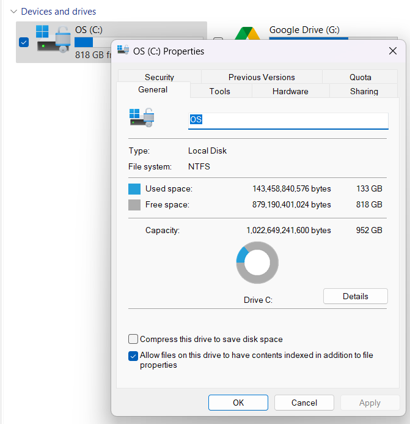
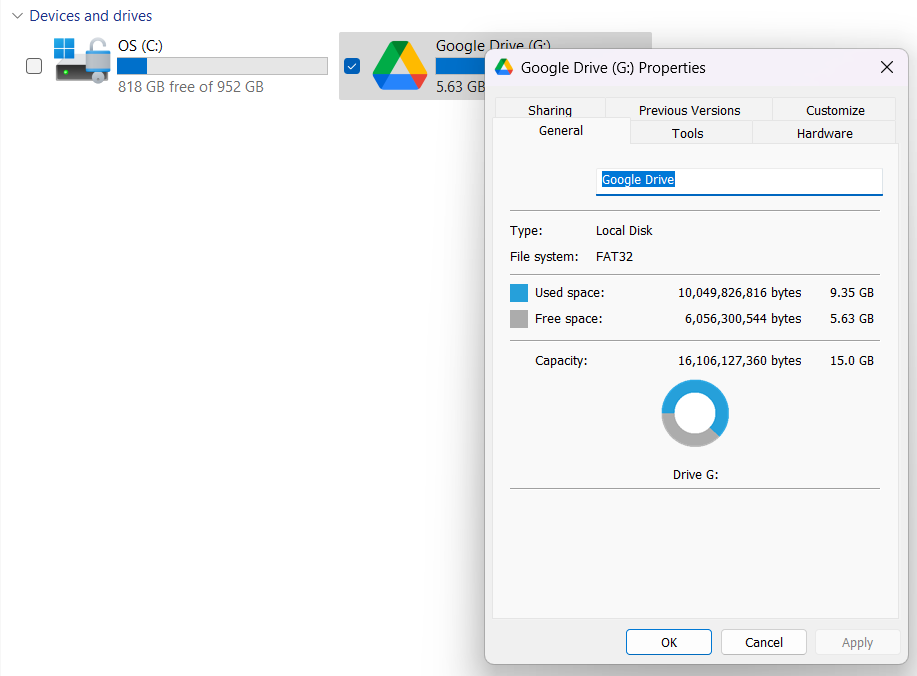
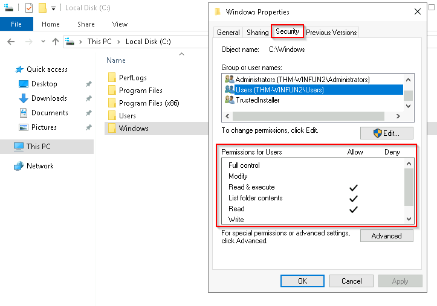
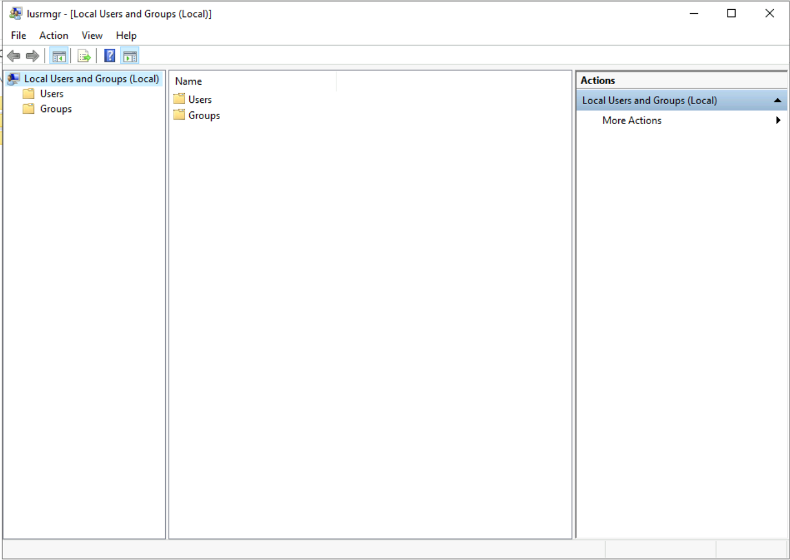

# Room 1 - Windows fundamentals 1

## File system

1. NTFS, FAT, HPFS
    The file system used in modern versions of  Windows  is the New Technology File System or simply  NTFS. Before NTFS, there was  FAT16/FAT32 (File Allocation Table) and HPFS (High Performance File System). 

    You still see FAT partitions in use today. For example, you typically see FAT partitions in USB devices, MicroSD cards, etc.  but traditionally not on personal Windows computers/laptops or Windows servers.

    NTFS is known as a journaling file system. In case of a failure, the file system can automatically repair the folders/files on disk using information stored in a log file. This function is not possible with FAT.   

1. Limitations addressed by NTFS

    NTFS addresses many of the limitations of the previous file systems; such as: 

    - Supports files larger than 4GB
    - Set specific permissions on folders and files
    - Folder and file compression
    - Encryption ( Encryption File System or EFS )

1. Checking file system in windows

    1. File system of Windows OS on my PC

        

    1. File system of Google drive on my PC

        

1. Permissions in NTFS

    

    1. Checking permissions of a folder

        

## The Windows\System32 Folders

The Windows folder ( C:\Windows ) is traditionally known as the folder which contains the Windows operating system. 

The folder doesn't have to reside in the C drive necessarily. It can reside in any other drive and technically can reside in a different folder.

This is where environment variables, more specifically system environment variables, come into play.  Even though not discussed yet, the system  environment variable for the Windows directory is `%windir%`.

The System32 folder within windows is perhaps the most important. 

The System32 folder holds the important files that are critical for the operating system.

You should proceed with extreme caution when interacting with this folder. Accidentally deleting any files or folders within System32 can render the Windows OS inoperational.

Many of the tools that will be covered in the Windows Fundamentals series reside within the System32 folder. 

## User accounts, profiles, permissions

User accounts can be one of two types on a typical local Windows system: Administrator & Standard User.

`Start menu > other users` gives list of all users added to the system apart from the admin. 

If you are the admin you see an option to add a new user. If you click on this you are taken to the local user and group manager dialog box. Here, all groups and users are listed. 

Another way to open local user and group manager is `Win + R > lusrmgr.msc`.

