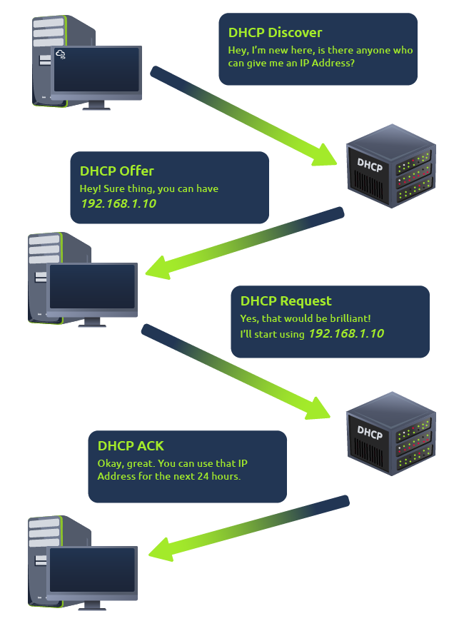

# Intro to LAN

## Switch vs Router 

- Switch works within a LAN. 
- Router connects different LANs. Router is what has internet capabilities and support NATs (Network address translation).

- Subnets use IP addresses in three different ways:

    - Identify the network address 
    
        - identifies the start of the actual network and is used to identify a network's existence.

        - For example, a device with the IP address of 192.168.1.100 will be on the network identified by 192.168.1.0

    - Identify the host address

        - An IP address here is used to identify a device on the subnet.

        - For example, a device will have the network address of 192.168.1.1

    - Identify the default gateway

        - The default gateway address is a special address assigned to a device on the network that is **capable of sending information to another network**.

        - Any data that needs to go to a device that isn't on the same network (i.e. isn't on 192.168.1.0) will be sent to this device. These devices can use any host address but usually use either the first or last host address in a network (.1 or .254)

## ARP

- ARP allows a device to associate its MAC address with an IP address on the network. 

- Broadcast request sent by a host A asking what is the MAC address associated with a particular IP address 192.168.1.10. The host B that owns 192.168.1.10 gives ARP reply providing its MAC address. Host A is hence able to associate in its cache the IP address of host B with the MAC address of host B. 

    

## DHCP

DHCP servers allow newly joining host devices to get an IP address automatically. 

# OSI model

1. Physical

    Put simply, this layer references the physical components of the hardware used in networking and is the lowest layer that you will find. Devices use electrical signals to transfer data between each other in a binary numbering system (1's and 0's). 
    
    For example, **ethernet cables connecting devices.**

1. Data Link 

    Receives packet from Network layer and adds MAC address information.

    The MAC address is the address burnt into the Network Interface Card (NIC) of the remote system by the NIC manufacturer. It cannot be changed but can be spoofed. 

1. 

